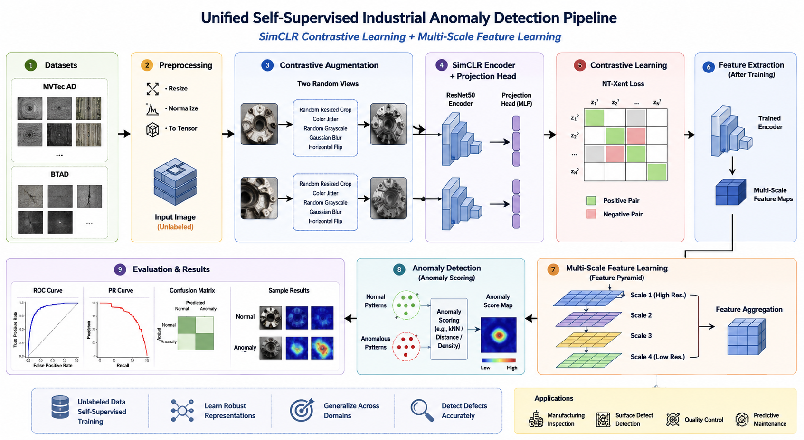
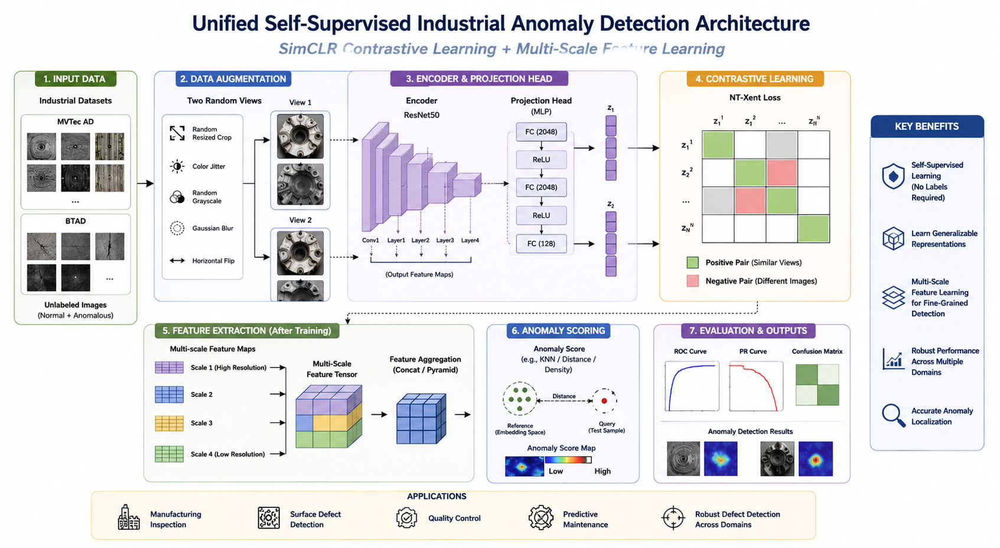

# Self-Supervised Industrial Anomaly Detection using SimCLR and Multi-Scale Feature Learning

<div align="center">


### Self-Supervised Industrial Defect Detection using Contrastive Learning and Multi-Scale Feature Representation

*A PyTorch implementation of SimCLR-based self-supervised learning for industrial anomaly detection using multi-scale feature extraction across MVTec AD and BTAD datasets.*

</div>

---

# Overview

Industrial anomaly detection is a critical task in modern manufacturing systems where defective products must be identified accurately while minimizing manual inspection costs. Traditional supervised approaches require large amounts of labeled defective samples, which are often scarce, expensive to obtain, and difficult to annotate.

This project presents a **Self-Supervised Industrial Anomaly Detection Framework** that leverages **SimCLR contrastive learning** to learn discriminative feature representations without requiring defect annotations during pretraining. The learned representations are further enhanced using **multi-scale feature learning**, enabling robust detection and localization of anomalies across multiple industrial domains.

The framework is evaluated on the **MVTec AD** and **BTAD** industrial anomaly detection datasets using comprehensive quantitative and qualitative evaluation metrics.

---

# Key Features

- Self-Supervised Representation Learning
- SimCLR Contrastive Learning Framework
- Multi-Scale Feature Extraction
- ResNet50 Backbone
- Industrial Defect Detection
- Cross-Domain Feature Learning
- MVTec AD Support
- BTAD Support
- PyTorch Implementation
- ROC & PRO Curve Evaluation
- Defect Localization using Anomaly Heatmaps
- State-of-the-Art Performance Comparison

---

# Pipeline

<p align="center">

</p>

The proposed pipeline consists of the following stages:

1. Industrial Dataset Collection
2. Image Preprocessing
3. SimCLR Data Augmentation
4. Contrastive Representation Learning
5. Feature Extraction using ResNet50
6. Multi-Scale Feature Aggregation
7. Anomaly Scoring
8. Defect Localization
9. Performance Evaluation

---

# Model Architecture

<p align="center">

</p>

The proposed architecture integrates self-supervised representation learning with multi-scale feature aggregation for industrial anomaly detection.

Major components include:

- Image Preprocessing
- SimCLR Augmentation
- ResNet50 Encoder
- Projection Head
- NT-Xent Contrastive Loss
- Multi-Scale Feature Learning
- Feature Aggregation
- Anomaly Detection Module
- Evaluation Pipeline

---

# Repository Structure

```text
Self-Supervised-Industrial-Anomaly-Detection/
│
├── assets/
│   ├── Architecture.png
│   ├── Pipeline.png
│
├── docs/
│   ├── DATASET.md
│   ├── INSTALLATION.md
│   ├── RESULTS.md
│
├── notebooks/
│   ├── Self-Supervised-Industrial-Anomaly-Detection.ipynb
│
├── outputs/
│   ├── AUC-SOTA-Comparison.png
│   ├── Confusion-Matrix.png
│   ├── Localization-Defect-Anomaly-Heatmap.png
│   ├── Preprocessing-Visualization.png
│   ├── PRO-Curve.png
│   ├── ROC-Evaluation.png
│   ├── Score-Distribution.png
│
├── LICENSE
├── README.md
└── requirements.txt
```

---

# Methodology

The proposed framework consists of four major stages:

## 1. Data Preprocessing

Industrial images from the MVTec AD and BTAD datasets are resized, normalized, and transformed into a consistent format suitable for contrastive learning.

---

## 2. Self-Supervised Representation Learning

Instead of relying on labeled defect samples, the framework employs **SimCLR** to learn meaningful feature representations from unlabeled images.

Two augmented views of each image are generated using transformations such as:

- Random Crop
- Color Jitter
- Gaussian Blur
- Random Horizontal Flip
- Random Grayscale

The encoder learns invariant representations by maximizing agreement between positive pairs using the **NT-Xent contrastive loss**.

---

## 3. Multi-Scale Feature Learning

Feature maps extracted from different layers of the ResNet50 backbone are aggregated to capture both low-level texture information and high-level semantic representations.

This multi-scale strategy significantly improves anomaly localization and detection performance across diverse industrial categories.

---

## 4. Anomaly Detection

The learned feature representations are used to compute anomaly scores for unseen images.

Higher anomaly scores indicate a greater likelihood of defects, enabling accurate classification and localization without requiring pixel-level supervision.

---

# Results

The proposed framework was evaluated on industrial anomaly detection datasets using multiple quantitative and qualitative metrics. The results demonstrate the effectiveness of self-supervised representation learning with SimCLR and multi-scale feature learning for industrial defect detection.

## Performance Summary

| Metric | Score |
|:----------------------|:------:|
| **AUC Score** | **0.84** |
| **Overall Accuracy** | **87.0%** |
| **Anomaly Precision** | **0.88** |
| **Anomaly Recall** | **0.99** |
| **Anomaly F1-Score** | **0.93** |

> **Note:** The evaluation dataset is imbalanced (30 normal vs. 200 anomalous samples). Therefore, metrics such as **AUC**, **Recall**, and **F1-Score** provide a more informative assessment than overall accuracy alone.

---

## Classification Report

| Class | Precision | Recall | F1-Score | Support |
|:----------------|:---------:|:------:|:-------:|-------:|
| Anomaly (KO) | **0.88** | **0.99** | **0.93** | 200 |

---

## Evaluation Results

### Image Preprocessing

The preprocessing pipeline prepares industrial images by applying resizing, normalization, and transformations before self-supervised representation learning.

<p align="center">

</p>

---

### ROC Evaluation

The Receiver Operating Characteristic (ROC) curve evaluates the model's ability to distinguish between normal and anomalous samples over multiple decision thresholds.

<p align="center">

</p>

---

### PRO Curve

The Per-Region Overlap (PRO) curve evaluates anomaly localization quality by measuring the overlap between predicted anomaly regions and ground truth masks.

<p align="center">

</p>

---

### Confusion Matrix

The confusion matrix summarizes the classification performance on the evaluation dataset.

<p align="center">

</p>

---

### Score Distribution

The anomaly score distribution demonstrates the separation between normal and anomalous samples learned through self-supervised representation learning.

<p align="center">

</p>

---

### Defect Localization

The proposed framework successfully localizes defective regions using anomaly heatmaps generated from multi-scale feature representations.

<p align="center">

</p>

---

### Comparison with State-of-the-Art Methods

The proposed approach is compared with existing industrial anomaly detection methods using the Area Under the ROC Curve (AUC).

<p align="center">

</p>

---

## Key Findings

- Achieved an **AUC of 0.84**, demonstrating strong discrimination between normal and anomalous samples.
- Reached **87% overall classification accuracy** on the evaluation dataset.
- Achieved **99% anomaly recall**, minimizing missed defective products.
- Obtained an **F1-score of 0.93** for anomaly detection, indicating an excellent balance between precision and recall.
- Multi-scale feature learning improved feature representation for industrial inspection tasks.
- SimCLR-based self-supervised learning reduced dependence on manually annotated defect data while maintaining competitive performance.

For a more detailed discussion of the experimental evaluation, see **docs/RESULTS.md**.

---

# Technologies Used

- Python
- PyTorch
- Torchvision
- NumPy
- OpenCV
- Scikit-learn
- Matplotlib
- Pillow (PIL)
- Google Colab

---

# Datasets

This project utilizes two widely used industrial anomaly detection datasets:

| Dataset | Description |
|----------|-------------|
| **MVTec AD** | Benchmark dataset containing multiple industrial object and texture categories with pixel-level anomaly annotations. |
| **BTAD** | BeanTech Anomaly Detection Dataset consisting of real industrial inspection images from manufacturing environments. |

Dataset download and preparation instructions are available in **docs/DATASET.md**.

---

# Installation

Detailed installation instructions, environment setup, and dependency management are available in:

```text
docs/INSTALLATION.md
```

---

# Applications

This framework can be applied to a wide range of industrial inspection tasks, including:

- Automated Visual Inspection
- Manufacturing Quality Control
- Surface Defect Detection
- Smart Factory Automation
- Predictive Maintenance
- Industrial Computer Vision
- Unsupervised Defect Detection Research

---

# Future Work

Potential directions for extending this project include:

- Vision Transformer (ViT) backbones
- DINOv2 self-supervised pretraining
- Masked Autoencoders (MAE)
- EfficientNet and ConvNeXt feature extractors
- Few-shot anomaly detection
- Real-time industrial deployment
- Edge AI optimization
- Explainable anomaly detection
- Cross-domain adaptation

---

# Citation

If you use this repository in your research or projects, please cite it as:

```bibtex
@misc{Ahmed2026IndustrialAnomalyDetection,
  author       = {Nauman Ahmed},
  title        = {Self-Supervised Industrial Anomaly Detection using SimCLR and Multi-Scale Feature Learning},
  year         = {2026},
  publisher    = {GitHub},
  url          = {https://github.com/Nauman54/Self-Supervised-Industrial-Anomaly-Detection}
}
```

---

# Acknowledgements

This project builds upon several influential open-source projects and datasets:

- PyTorch
- Torchvision
- SimCLR
- MVTec AD
- BTAD
- OpenCV
- Scikit-learn

Special thanks to the open-source community for making high-quality datasets and deep learning libraries publicly available.

---

# License

This project is licensed under the **MIT License**.

See the `LICENSE` file for more details.

---

# Author

## Nauman Ahmed

**AI Engineer | Machine Learning | Deep Learning | Computer Vision | Generative AI**

- GitHub: https://github.com/Nauman54
- LinkedIn: https://linkedin.com/in/naumanahmed254

---

<div align="center">

### ⭐ If you found this project useful, consider starring the repository!

Contributions, suggestions, and feedback are always welcome.

</div>
