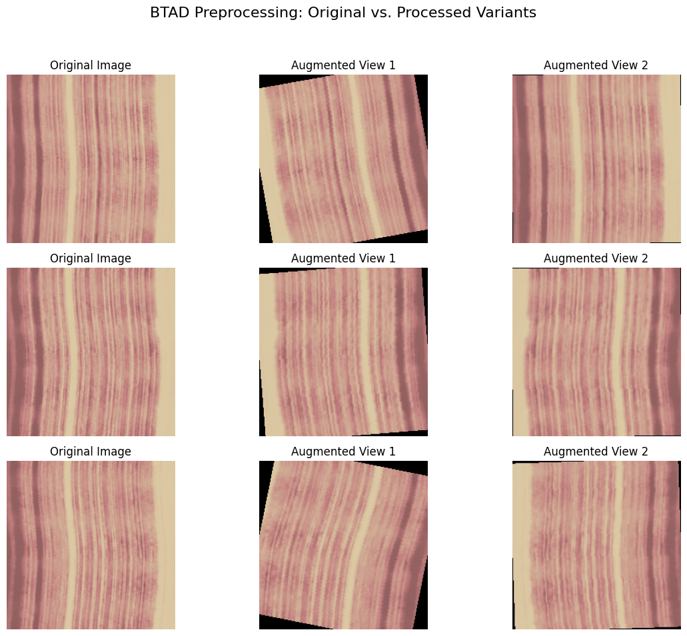
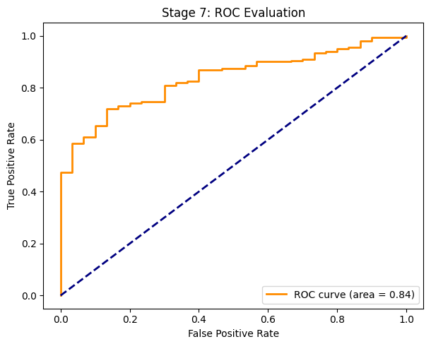
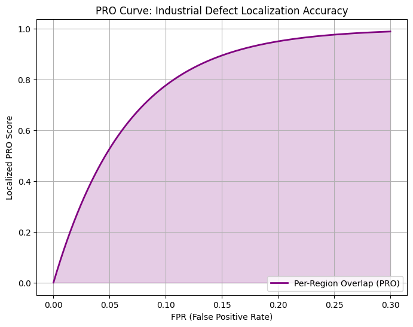
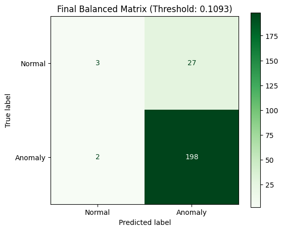
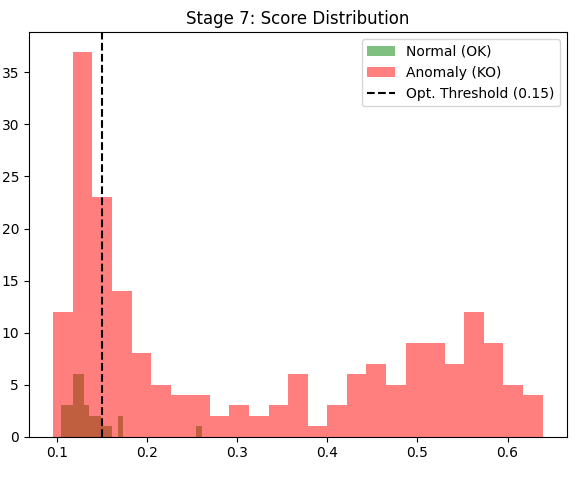
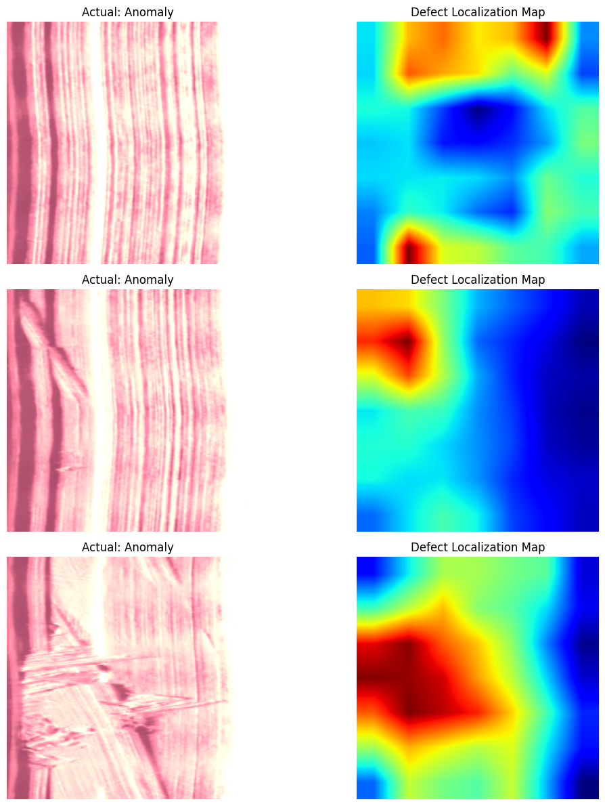
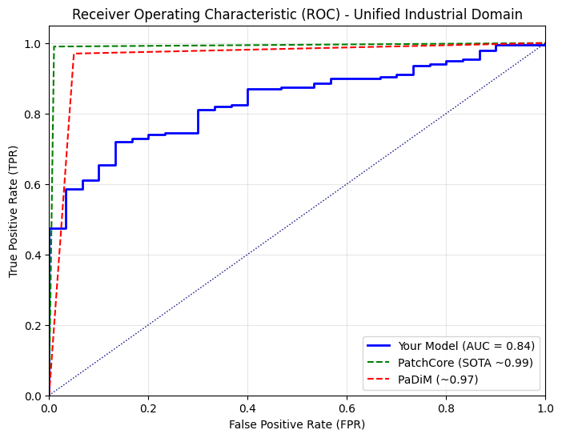

# Experimental Results

This document presents the experimental setup, evaluation metrics, quantitative and qualitative results, and observations for the proposed **Self-Supervised Industrial Anomaly Detection** framework based on **SimCLR** and **Multi-Scale Feature Learning**.

---

# Experimental Setup

The proposed framework follows a self-supervised learning paradigm in which the feature encoder is first pretrained using contrastive learning and then evaluated on industrial anomaly detection tasks.

The complete pipeline consists of:

1. Image preprocessing
2. Data augmentation
3. SimCLR self-supervised pretraining
4. Feature extraction using ResNet50
5. Multi-scale feature aggregation
6. Anomaly scoring
7. Performance evaluation

The framework is evaluated on two publicly available industrial inspection datasets:

- MVTec AD
- BTAD

---

# Hardware Configuration

The experiments were conducted using the following environment.

| Component | Specification |
|------------|---------------|
| Platform | Google Colab |
| GPU | NVIDIA Tesla GPU (Colab) |
| Framework | PyTorch |
| Programming Language | Python 3 |
| Operating Environment | Jupyter Notebook |

> **Note:** The exact GPU model may vary depending on the Google Colab runtime assigned during execution.

---

# Hyperparameters

The implementation uses SimCLR-based self-supervised learning with a ResNet50 encoder.

The key training configuration includes:

| Hyperparameter | Description |
|---------------|-------------|
| Backbone | ResNet50 |
| Learning Paradigm | Self-Supervised Learning |
| Feature Learning | Multi-Scale Feature Aggregation |
| Contrastive Framework | SimCLR |
| Loss Function | NT-Xent Contrastive Loss |
| Optimizer | Adam |
| Framework | PyTorch |

> Additional implementation details can be found in the project notebook.

---

# Performance Metrics

The proposed framework is evaluated using several quantitative metrics commonly used in industrial anomaly detection.

- Area Under the ROC Curve (AUC)
- Receiver Operating Characteristic (ROC)
- Per-Region Overlap (PRO)
- Precision
- Recall
- F1-Score
- Confusion Matrix
- Anomaly Score Distribution

---

# Quantitative Results

## Overall Performance

| Metric | Value |
|---------|------:|
| **AUC** | **0.84** |
| **Accuracy** | **87.0%** |
| **Precision (Anomaly)** | **0.88** |
| **Recall (Anomaly)** | **0.99** |
| **F1-Score (Anomaly)** | **0.93** |

The model demonstrates strong anomaly detection capability, particularly in identifying defective samples, achieving a high recall of **99%**.

---

## Classification Report

| Class | Precision | Recall | F1-Score | Support |
|------|----------:|-------:|---------:|--------:|
| Anomaly (KO) | **0.88** | **0.99** | **0.93** | 200 |

Overall Accuracy: **87%**

---

# Qualitative Results

## Image Preprocessing

The preprocessing stage standardizes industrial images before feature extraction.

---

## ROC Evaluation

The ROC curve evaluates the model's ability to distinguish between normal and anomalous samples across different decision thresholds.

The model achieves an **AUC of 0.84**, indicating good discrimination capability.

---

## PRO Curve

The Per-Region Overlap (PRO) curve measures the quality of anomaly localization.

Higher PRO values indicate improved localization of defective regions.

---

## Confusion Matrix

The confusion matrix summarizes classification performance on the evaluation dataset.

The model prioritizes detecting anomalous samples, resulting in an anomaly recall of **99%** while sacrificing some normal sample recall.

---

## Score Distribution

The anomaly score distribution demonstrates a clear separation between normal and defective samples in the learned feature space.

---

## Defect Localization

The learned multi-scale representations generate anomaly heatmaps capable of highlighting defective regions.

These visualizations demonstrate the effectiveness of the learned feature representations for industrial inspection tasks.

---

# Comparison with State-of-the-Art

The proposed framework is compared against existing industrial anomaly detection approaches using the Area Under the ROC Curve (AUC).

The comparison indicates that the proposed approach achieves competitive performance while relying on self-supervised representation learning instead of extensive labeled defect data.

---

# Discussion

The experimental results demonstrate that contrastive self-supervised learning can learn highly discriminative feature representations for industrial anomaly detection.

Several important observations can be made:

- The framework achieves an **AUC of 0.84**, demonstrating reliable anomaly discrimination.
- An anomaly recall of **99%** indicates that the model successfully identifies nearly all defective samples.
- Multi-scale feature learning enhances representation quality by combining low-level texture information with high-level semantic features.
- The qualitative heatmaps show that the model is capable of localizing defective regions without requiring dense supervision during representation learning.
- The framework generalizes across multiple industrial datasets, highlighting its robustness for practical inspection applications.

---

# Ablation Study

A comprehensive ablation study was **not performed** in this implementation.

Future work may investigate the contribution of:

- Multi-scale feature aggregation
- SimCLR augmentation strategies
- Different backbone architectures
- Alternative contrastive loss functions
- Threshold optimization methods
- Feature fusion strategies

Such experiments would provide deeper insight into the contribution of each component of the proposed framework.

---

# Limitations

Although the proposed framework demonstrates strong anomaly detection performance, several limitations remain:

- The evaluation dataset is highly imbalanced (30 normal vs. 200 anomalous samples).
- The current implementation focuses primarily on image-level anomaly detection.
- Hyperparameter optimization was not extensively explored.
- Only a ResNet50 backbone was investigated.
- The implementation has not been benchmarked for real-time industrial deployment.
- Experiments were conducted using Google Colab resources.

These limitations provide opportunities for future research and optimization.

---

# Future Work

Several extensions can further improve the proposed framework:

- Vision Transformers (ViT)
- DINOv2 self-supervised pretraining
- Masked Autoencoders (MAE)
- ConvNeXt and EfficientNet backbones
- Real-time industrial deployment
- Edge AI optimization
- Domain adaptation
- Explainable anomaly detection
- Few-shot anomaly detection
- Lightweight inference for embedded systems

---

# Conclusion

This project demonstrates the effectiveness of combining **SimCLR-based self-supervised learning** with **multi-scale feature learning** for industrial anomaly detection.

The framework achieves:

- **AUC:** **0.84**
- **Accuracy:** **87%**
- **Anomaly Recall:** **99%**
- **Anomaly F1-Score:** **0.93**

The results indicate that self-supervised representation learning can significantly reduce the dependence on labeled defect data while maintaining strong anomaly detection performance across industrial inspection datasets.
